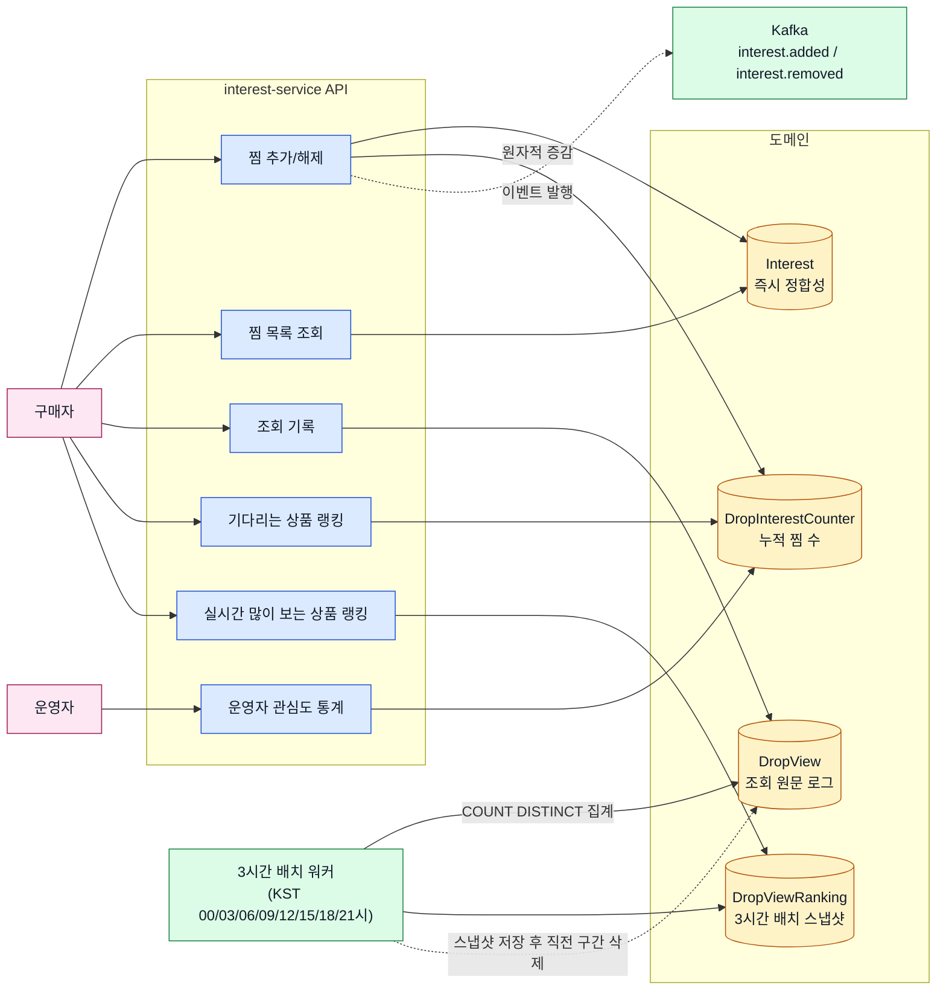
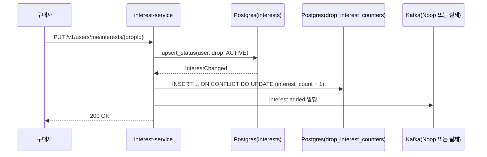
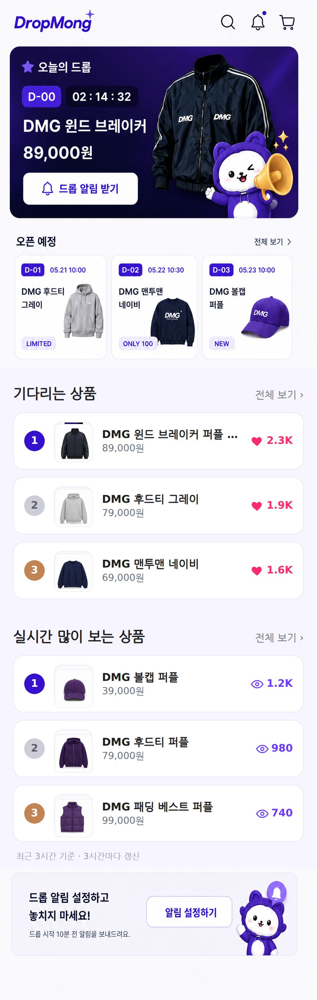

# interest-service 구현 보고

- 작성일: 2026-07-14
- 대상 서비스: `interest-service` (찜/위시리스트 + 랭킹)
- 레포: `medikong/archive`(설계 문서), `medikong/service`(코드)

## 1. 개요

DropMong의 "찜(위시리스트)" 기능과, 찜/조회 신호를 기반으로 한 두 종류의 실시간 랭킹 기능을 처음부터 끝까지(요구사항 → 도메인 설계 → API 계약 → 코드 → 테스트 → 문서 정합성)까지 완성했다. 기존에 UI 설계에는 있었지만 이를 뒷받침하는 백엔드 서비스가 없던 상태였고, 이번에 신규 독립 서비스(interest-service)로 처음부터 만들었다.

## 2. 구현 범위

| 기능 | 설명 | 상태 |
| --- | --- | --- |
| 찜 추가/해제 | 로그인 사용자가 드롭을 찜하거나 해제한다 | 완료 |
| 찜 목록 조회 | 내가 찜한 드롭 목록을 페이지네이션으로 조회한다 | 완료 |
| 기다리는 상품 랭킹 | 드롭 상태와 무관하게, 리셋 없는 누적 활성 찜 수 기준 Top 100 | 완료 |
| 실시간 많이 보는 상품 랭킹 | 최근 3시간 서로 다른 조회자 수 기준 Top 100, 3시간마다 배치 갱신 | 완료 |
| 드롭 조회 기록 | 상품 상세 진입을 관심 신호로 기록 | 완료 |
| 운영자용 관심도 통계 | 드롭별 누적 찜 수를 운영자가 조회 | 완료 |
| 오픈 후 판매속도 랭킹 | order-service 연동 필요 | **보류**(후속 스코프) |

## 3. 핵심 설계 결정과 근거

실제 사례 조사와 논의를 거쳐 다음과 같이 결정했다. (모두 `REQ.A.07` 문서의 "수정 이력"에 근거와 함께 기록됨)

1. **오픈 전/오픈 후 랭킹은 하나로 합치지 않는다.** 티켓팅 사이트(인터파크), Steam(Top Sellers vs Most Wishlisted), Kickstarter(Most Funded vs Trending), 와디즈(오픈예정 vs 펀딩중) 등을 조사한 결과, 판매 신호와 관심 신호를 하나의 점수로 섞지 않는 것이 업계 공통 패턴임을 확인했다.
2. **찜 랭킹("기다리는 상품")은 "당일 순증감"이 아니라 "리셋 없는 누적치"로 산정한다.** 찜은 반복 행동이 아니라 한 번 누르고 유지되는 상태라, 당일 증감만 세면 신호가 희박해진다. 이 판단 덕분에 catalog-service의 드롭 상태(`drop_phase`) 의존이 완전히 사라졌다.
3. **조회 랭킹("실시간 많이 보는 상품")은 Redis 없이 Postgres만으로 구현한다.** 조회를 매번 원문 그대로 기록하고, 집계 시점에 `COUNT(DISTINCT user_id)`로 세면 같은 사용자의 반복 조회가 자연히 1명으로 처리돼 별도 dedup 인프라가 필요 없다.
4. **조회 랭킹은 KST 3시간 고정 구간(00/03/06/09/12/15/18/21시) 배치로 계산한다.** "실시간"이 꼭 밀리초 단위일 필요는 없다는 판단하에, 매 API 호출마다 무거운 집계 쿼리를 돌리지 않고 3시간마다 한 번만 계산해 스냅샷 테이블에 저장한다. 부하 측면에서 남는 위험은 "조회 기록 쓰기 경로의 핫키"뿐으로 좁혔다.
5. **조회 원본 데이터는 무한정 쌓이지 않는다.** 배치가 스냅샷을 저장한 직후 이미 스냅샷으로 만든 직전 구간의 원본을 지운다(안전 마진 1구간). 별도 청소 배치 없이 항상 최대 6시간분만 유지된다.
6. **찜 카운터 증감은 낙관적 잠금 대신 Postgres 원자적 연산(`INSERT ... ON CONFLICT DO UPDATE`)을 쓴다.** 재조회-재시도 로직이 필요 없어지고, 50개 동시 요청 테스트로 정확성을 확인했다.
7. **홈 화면은 두 랭킹 각각 Top 3만 보여주고, "전체보기"는 Top 100까지 보여준다.**

## 4. 아키텍처 요약

- **Aggregate 2개**: `Interest`(찜 상태, 즉시 정합성) / `DropInterestCounter`(찜 누적 카운터, 지연 허용)
- **부가 개념 1개**: `DropView`(조회 원문 로그 + 3시간 배치 스냅샷, Aggregate로 승격하지 않음 — 도메인 불변조건이 없는 순수 이벤트 로그이기 때문)
- **이벤트 발행**: 찜 추가/해제 시 `interest.added`/`interest.removed`를 Kafka로 발행(Noop/Kafka 구현체 분리 — 카프카 없는 로컬 환경에서도 정상 동작)
- **배치 워커**: 3시간마다 조회 랭킹 스냅샷을 계산하는 백그라운드 워커(서비스 기동 시 자동 시작, 재시작 직후 결측 방지를 위해 시작하자마자 한 번 즉시 계산)

찜 추가 한 번이 실제로 어떤 순서로 처리되는지는 아래 시퀀스로 요약된다:

## 5. API 목록

| Method | Path | 설명 |
| --- | --- | --- |
| PUT | `/v1/users/me/interests/{dropId}` | 찜 추가 |
| DELETE | `/v1/users/me/interests/{dropId}` | 찜 해제 |
| GET | `/v1/users/me/interests` | 내 찜 목록 |
| POST | `/v1/drops/{dropId}/views` | 조회 기록 |
| GET | `/v1/rankings/drops/upcoming` | 기다리는 상품 랭킹 |
| GET | `/v1/rankings/drops/trending` | 실시간 많이 보는 상품 랭킹 |
| GET | `/v1/operator/drops/{dropId}/interest-stats` | 운영자용 관심도 통계 |
| GET | `/v1/rankings/drops/open` | 오픈 후 랭킹(보류, 문서만 존재) |

## 6. 검증

- **유닛 테스트 30개** — 카운터 증감/동시성, 랭킹 정렬/페이지네이션, 조회 기록, 3시간 배치 워커 스케줄링 로직, Kafka 발행 로직(가짜 프로듀서), API 라운드트립 전부 포함. 전부 통과.
- **실제 Postgres 통합 검증** — 원자적 증감의 동시성 안전성을 50개 동시 요청으로 확인(정확히 51 도달), 실제 `COUNT(DISTINCT)` 집계, 보존 기간 청소 로직까지 실 DB로 확인.
- **실제 서버 기동 후 엔드투엔드 확인** — 찜 추가 → 랭킹 반영, 조회 기록 → 배치 계산 → 랭킹 API 응답까지 curl로 직접 확인.
- **한계**: 진짜 카프카 브로커가 없는 환경이라 `KafkaInterestEventPublisher`의 실제 브로커 연동은 로직만 검증했고 end-to-end 검증은 못 했다. 대규모 부하테스트는 하지 않았다(50개 동시 요청 수준까지만 확인).

## 7. 알려진 한계 / 후속 과제

- 오픈 후(판매속도) 랭킹은 order-service 연동 방식이 미정이라 보류.
- 상품 상세 화면이 "이 드롭을 내가 찜했는지" 초기 상태를 물어볼 단건 조회 API가 아직 없음(목록 API만 있음) — 문서에 확인 필요로 남겨둠.
- 조회 랭킹 구간 경계 직후(예: 03:00:01)에 새 스냅샷이 아직 없을 때 직전 값을 보여줄지 빈 목록을 보여줄지 미정.
- `drop_views` 청소는 배치에 통합했지만, 핫키(특정 드롭에 조회가 몰리는 상황) 대응은 실측 트래픽이 나온 뒤 결정하기로 미룸.

## 8. 화면 반영 예시

홈 화면의 "기다리는 상품"/"실시간 많이 보는 상품" 두 랭킹 섹션(실제 상품 사진 반영):

## 9. 관련 문서(archive 레포)

- 요구사항: `00-requirements/REQ_A_07_interest_ranking.md`
- 유스케이스: `30-uc/UC_A_07_interest_ranking.md`
- 바운디드 컨텍스트: `40-event-storming-bounded-context/BC_A_07_interest_ranking.md`
- 서비스 설계: `50-service-design/A_07_interest_ranking/`(도메인모델/영속성/서비스/API)
- 화면: `PAGE.A.01`(홈), `PAGE.A.09`(기다리는 상품), `PAGE.A.22`(찜리스트), `PAGE.A.23`(실시간 많이 보는 상품)
